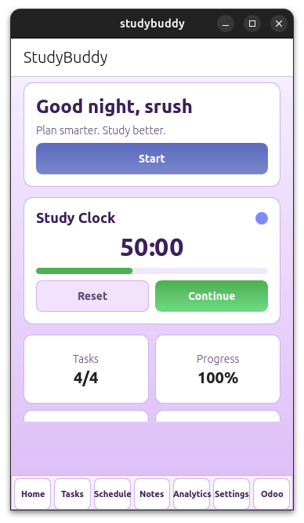
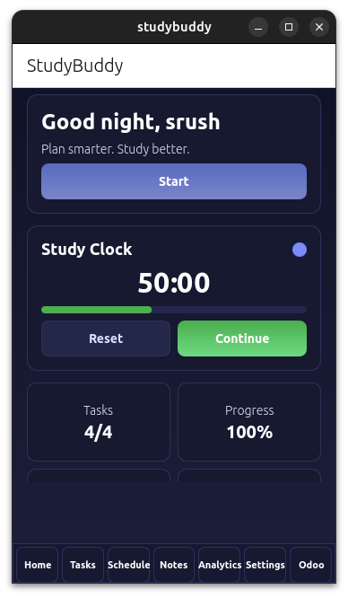
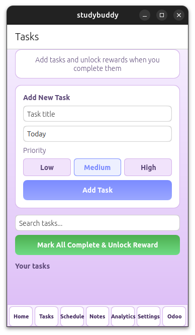
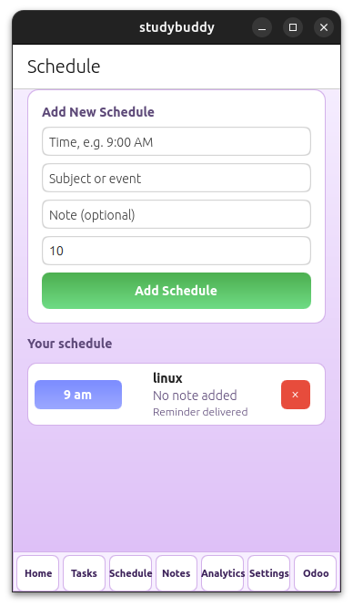
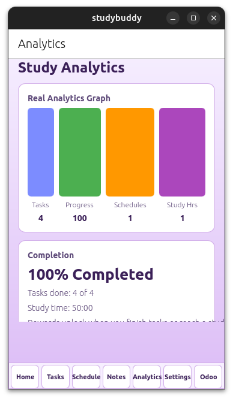
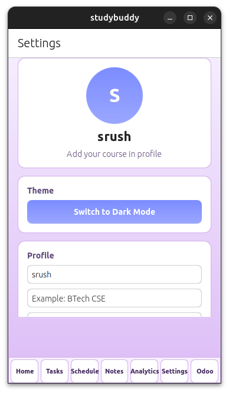

# StudyBuddy

A modern Ubuntu Touch productivity and academic management app built using QML and Lomiri Components.

StudyBuddy helps students manage tasks, schedules, reminders, study sessions, analytics, and productivity tracking through a clean and responsive interface.

---

## Features

- Task Management System
- Study Session Timer
- Productivity Analytics Dashboard
- Schedule & Reminder System
- Dark / Light Theme Support
- Persistent Local Storage
- Responsive Ubuntu Touch UI
- Reward & Motivation System

---

## Tech Stack

- QML
- QtQuick
- Lomiri Components
- Ubuntu Touch
- Clickable Framework
- Qt Labs Settings

---

## Screenshots

### Home Screen


### Dark Mode


### Tasks


### Schedule


### Analytics


### Settings


---

## Installation

```bash
git clone https://github.com/srush0/Studybuddy.git
cd Studybuddy
clickable build
```

---

## Project Structure

```text
Main.qml                 Main application UI
manifest.json.in         App manifest
clickable.yaml           Clickable configuration
studybuddy.desktop.in    Desktop launcher
studybuddy.apparmor      App permissions
```

---

## Future Improvements

- Cloud Synchronization
- AI Study Assistant
- Calendar Integration
- Push Notifications
- Cross-device Sync
- Odoo Integration

---

## Author

Srushti Kulkarni

---

## License

Licensed under the MIT License.
